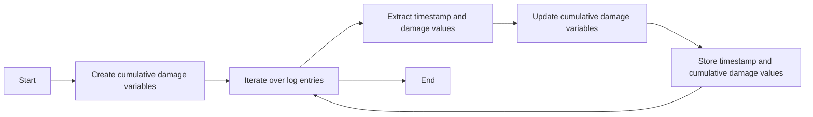

# Combat Log Parser

## Divisions

### I. **Parsing the Combat Logs**

- Use JavaScript string manipulation functions or regular expressions to extract relevant information from the combat logs. You'll need to identify patterns and structures within the log entries to retrieve data such as timestamps, attacker, weapon used, target, and damage dealt/received.

### II. **Data Storage**

- Organize the extracted data into a suitable data structure, such as an array or object, to store the relevant information for further processing.

### III. **Calculating Damage over Time**

- Analyze the stored data to calculate the damage dealt and received over time. You can group the entries by timestamp and sum the damage values to get the cumulative damage at each point in time.

### IV. **Graphing the Data**

- Utilize a JavaScript charting library, such as Chart.js or D3.js, to create graphs and visualizations based on the calculated damage over time. You can plot the damage dealt and received on separate lines or use different colors to distinguish them.

### V. **Generating HTML Output**

- Create an HTML template or use JavaScript DOM manipulation to generate an HTML document dynamically. Insert the generated graphs into the HTML structure and format the content as desired.

### VI. **Rendering in the Browser**

- Serve the generated HTML file through a web server or open it locally in a browser to visualize the combat log data and the graph.

---

### I. Parsing The Data

#### RegEx

##### 1. **Extracting Damage Dealt and Received**

- To extract the damage dealt by an attacker:

```regex
/\]\s+(\d+)\s+from\s+<b><color=0xffffffff>([^<]+)/
```

- This regular expression captures the damage value and attacker's name.
- To extract the damage received by a target:

```regex
`/\]\s+(\d+)\s+to\s+<b><color=0xffffffff>([^<]+)/
```

- This regular expression captures the damage value and target's name.

##### 2. **Extracting Timestamp**

- To extract the timestamp from each log entry:

```regex
/\[\s+(\d{4}\.\d{2}\.\d{2}\s+\d{2}:\d{2}:\d{2})\s+\]/
```

- This regular expression captures the timestamp in the format `YYYY.MM.DD HH:MM:SS`.

##### 3. **Extracting Weapon Used**

- To extract the weapon used by an attacker:

```regex
/-\s+([^<]+)\s+-/
```

- This regular expression captures the weapon name.

##### 4. **Extracting Player Names**

- To extract player names:

```regex
/<b><color=0xffffffff>([^<]+)/
```

- This regular expression captures player names.

> Please note that these regular expressions are based on the sample data you provided, and they may need to be adjusted if the actual combat logs have variations in formatting or additional patterns. It's recommended to test and modify the regular expressions according to your specific combat log format.

### Timestamp

The regular expression for extracting the timestamp is:

```regex
/\[\s+(\d{4}\.\d{2}\.\d{2}\s+\d{2}:\d{2}:\d{2})\s+\]/
```

Let's break down the regular expression:

- `\[`: Matches the opening square bracket "[" character.
- `\s+`: Matches one or more whitespace characters.
- `(\d{4}\.\d{2}\.\d{2}\s+\d{2}:\d{2}:\d{2})`: Captures the timestamp in the format `YYYY.MM.DD HH:MM:SS`. Here's a breakdown of the timestamp pattern:
  - `\d{4}`: Matches four digits for the year.
  - `\.`: Matches the dot character "." as a separator.
  - `\d{2}`: Matches two digits for the month.
  - `\.`: Matches the dot character "." as a separator.
  - `\d{2}`: Matches two digits for the day.
  - `\s+`: Matches one or more whitespace characters.
  - `\d{2}`: Matches two digits for the hour.
  - `:`: Matches the colon character ":" as a separator.
  - `\d{2}`: Matches two digits for the minutes.
  - `:`: Matches the colon character ":" as a separator.
  - `\d{2}`: Matches two digits for the seconds.
- `\s+`: Matches one or more whitespace characters.
- `\]`: Matches the closing square bracket "]" character.

By using this regular expression, you can extract the timestamp from each log entry and retrieve the information about when each event occurred during the combat.

Certainly! Here's a flow chart in Mermaid notation representing the steps outlined for calculating and tracking damage over time:

Once you have extracted the timestamp from each log entry, the next step is to calculate and track the damage dealt and received over time.

Here's an outline of the process:

1. Create variables to store the cumulative damage dealt and received.
2. Iterate over each log entry.
3. Extract the timestamp and damage values from the log entry.
4. Update the cumulative damage dealt and received based on the extracted values.
5. Store the timestamp and cumulative damage values in separate arrays or data structures.
6. Continue this process for each log entry.
7. Optionally, you can convert the timestamp to a more suitable format for plotting, such as milliseconds since the start of combat.

At the end of this process, you will have two arrays or data structures containing

- timestamp
- cumulative damage values

These can be used for further analysis or visualization, such as plotting a graph of damage over time.

consider the type of damage (dealt or received) and handle each case accordingly while updating the cumulative damage variables.



This flow chart illustrates the iterative process of extracting data from the log entries, updating the cumulative damage variables, and storing the timestamp and cumulative damage values. The process continues until all log entries have been processed, after which the flow reaches the end.

```mermaid
graph LR
  subgraph "Combat Log Parser"
    direction TB
  A[Start] --> Z
    subgraph "Parse Data"
    direction TB
      Z["Start
a
new
iteration"] ---> B
      B["Read
Log
Entry"] --> C
      C{"Is
Log
Entry
Valid"}--No--> G{"Ignore
Log
Entryx}
      C --Yes--> E["Extract
Timestamp
and
Damage"]
      E --> F{"Is
Damage
Positive?"}
      F --No--> G["Ignore
Log
Entry"]
      G --> I
    end
    subgraph "Generate Output"
      direction TB
      F --Yes--> H["Update
Cumulative
Damage
Variables"]
      H --> I{"Is
There
More
Data?"}
      I --Yes--> Z
      I --No--> J["Generate
Damage
Graph"]
      J --> K[End]
    end
  end

```

This expanded flow chart considers additional checks and branches in the process. Here's a breakdown of the steps:

1. "Read Log Entry" represents the step of reading the next log entry from the dataset.
2. "Is Log Entry Valid?" checks whether the log entry is valid and can be processed further. If it's invalid, the flow moves to the "Ignore Log Entry" step.
3. "Extract Timestamp and Damage" involves extracting the timestamp and damage values from the log entry.
4. "Is Damage Positive?" checks whether the extracted damage value is positive. If it's not positive, the flow moves to the "Ignore Log Entry" step.
5. "Update Cumulative Damage Variables" updates the cumulative damage variables based on the extracted values.
6. "Is There More Data?" checks whether there is more data to process. If there is, the flow goes back to the "Read Log Entry" step to iterate over the next log entry. If there is no more data, the flow proceeds to the "Generate Damage Graph" step.
7. "Generate Damage Graph" represents the final step where the cumulative damage data is used to generate a graph.
8. Finally, the flow reaches the "End" point, indicating the completion of the process.

This more comprehensive flow chart captures the key steps and decision points involved in processing the log entries and updating the cumulative damage variables.

If you have any further questions or need additional assistance, feel free to ask!

### Example

To use the regular expressions, you'll need to implement them in your JavaScript code using the appropriate functions. Here's a brief example of how you can use regular expressions to extract information from the combat logs:

#### RegEx In Action

```js
// Example combat log entry
const logEntry =
  "[ 2023.06.04 17:46:37 ] (combat) <color=0xffcc0000><b>1633</b> <color=0x77ffffff><font size=10>from</font> <b><color=0xffffffff>Brittany Silver[TR-B-](Paladin)</b><font size=10><color=0x77ffffff> - Mega Pulse Laser II - Penetrates";

// Regular expressions
const timestampRegex = /\[ (\d{4}\.\d{2}\.\d{2} \d{2}:\d{2}:\d{2}) \]/;
const damageRegex = /<b>(\d+)<\/b>/;
const sourceRegex = /<b>(.*?)<\/b>/;
const weaponRegex = /- (.*?) -/;

// Extract timestamp
const timestampMatch = logEntry.match(timestampRegex);
const timestamp = timestampMatch ? timestampMatch[1] : null;
console.log("Timestamp:", timestamp);

// Extract damage
const damageMatch = logEntry.match(damageRegex);
const damage = damageMatch ? parseInt(damageMatch[1]) : null;
console.log("Damage:", damage);

// Extract source
const sourceMatch = logEntry.match(sourceRegex);
const source = sourceMatch ? sourceMatch[1] : null;
console.log("Source:", source);

// Extract weapon
const weaponMatch = logEntry.match(weaponRegex);
const weapon = weaponMatch ? weaponMatch[1] : null;
console.log("Weapon:", weapon);
```

In this example, we are provided four regular expressions for extracting different pieces of information from the combat log entry:

- timestamp
- damage
- source
  **and**
- weapon

You can use the match function on a string with a regular expression to find the first match. The result is an array where the first element contains the entire match, and subsequent elements contain the captured groups if any.

You can then use these extracted values to perform calculations, update trackers, or generate HTML for rendering in a browser.
